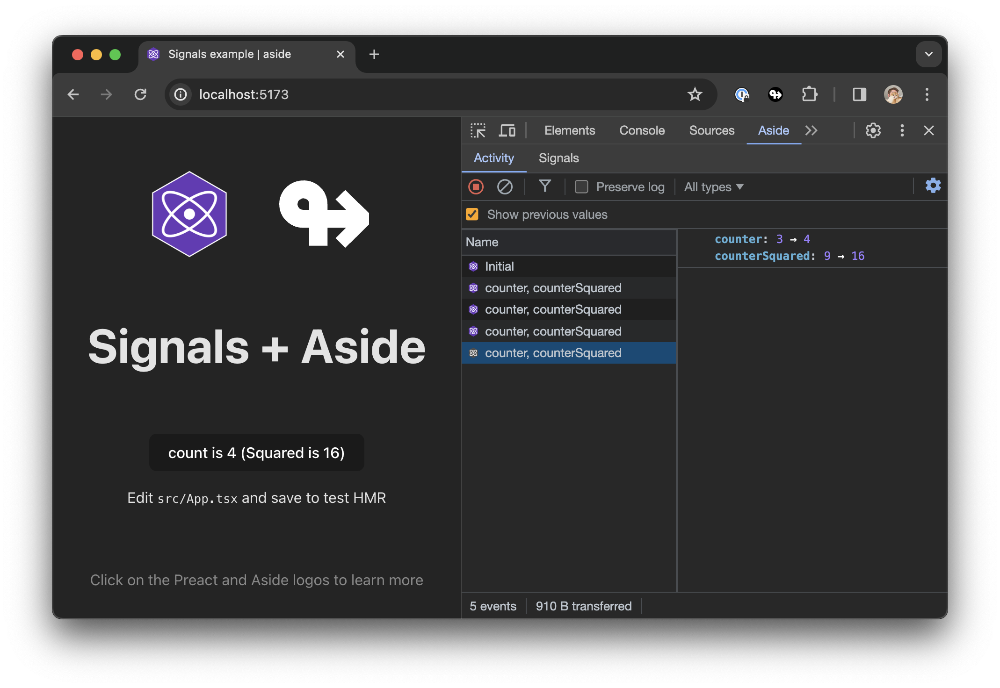

# ↬ aside · </div>


Aside is a Chrome extension that can render UI natively in the developer tools panel, controlled by your own React website.

It exposes a variety of APIs to empower your developer experience, without the friction of traditional Chrome extensions.

This notably allows developers to build developer tools that can evolve based on any application context. Users might want to use this to tailor their development experience based on:
* State management library (Redux, Recoil, Jotai, Signals)
* State persistence (Apollo cache, local storage)
* App routes



## Resources

- [Getting started](https://aside.dev/docs/introduction/getting-started)
- [Examples](https://aside.dev/examples)
- [Documentation](https://aside.dev)
- [Blog](https://aside.dev/blog)

## Contributing 

To contribute to the project, you can start the app using the following instructions:

1. Install dependencies.

```sh
yarn
```

2. Start the development server of the browser extension.

```sh
yarn dev
```

3. Start a Chrome instance with the extension installed in development mode.

```sh
yarn open-chrome
```
