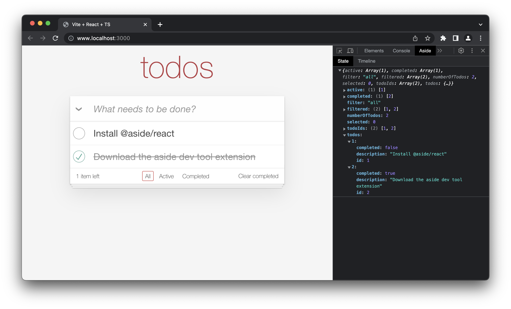

#  aside · 


Aside is a modular browser extension built to be a companion to any web application. The libraries provided by Aside allows users to render React components in their own application and uses a custom remote and reconciler to render those components into the Chrome developer tools.

This notably allows developers to build developer tools that can evolve based on any application context. Users might want to use this to tailor their development experience based on:
* State management library (Redux, Recoil, Jotai)
* State persistence (Apollo cache, local storage)
* App routes

## [Example](https://github.com/alxclark/aside/tree/main/packages/recoil)

Aside exposes an [npm](https://docs.npmjs.com/getting-started) package for a complete [Recoil](https://github.com/facebookexperimental/Recoil) devtools, built using Aside's primitives.



The chrome extension is powered by Shopify's [remote-ui](https://github.com/Shopify/remote-ui) which enables remote rendering.

## Getting started

1. Install dependencies.

```sh
yarn add @aside/react @aside/chrome-ui-remote
```

2. Import the `Aside` and `Devtools` component and render a remote component in your application.

In the example below, we are using `Button` from `@aside/chrome-ui-remote`. Chrome UI is one of the UI packages that Aside offers. It mirrors the native Chrome look and feel and is our recommendation for new users.

```jsx
import React, {useState} from 'react';
import {Aside, Devtools} from '@aside/react';
import {Button} from '@aside/chrome-ui-remote';

export function App({children}) {
  const [count, setCount] = useState(0)

  return (
    <div>
      {count}
      <Aside>
        <Devtools>
          <Button onPress={(prev) => setCount(prev + 1)}>Increment</Button>
        </Devtools>
      </Aside>
    </div>
  );
}
```

3. That's it! Go to your application, open the devtools and select `Aside` and your `Button` should now appear and correctly update the count from the chrome panel.

## Contributing 

To contribute to the project, you can start the app using the following instructions:

1. Install dependencies.

```sh
yarn
```

2. Start the development server of the browser extension.

```sh
yarn dev
```

3. Start a Chrome instance with the extension installed in development mode.

```sh
yarn open-chrome
```

4. (Optional) In order to see all the components offered by Aside, run:

```sh
yarn storybook
```
